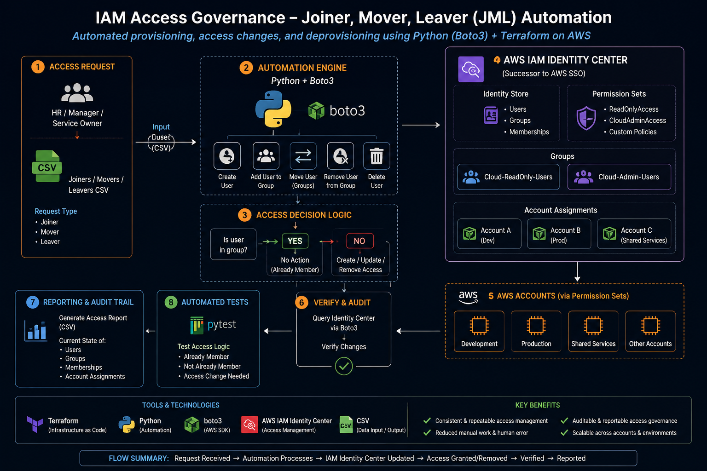

# AWS IAM Access Governance Automation

## Project Overview

This project demonstrates an automated AWS Identity and Access Management (IAM) governance solution built with Terraform, Python, Boto3, AWS IAM Identity Center, CSV-driven access requests, and automated testing.

The solution combines Infrastructure as Code with identity lifecycle automation to manage governed workforce access to AWS.

Terraform is used to provision and maintain the AWS IAM Identity Center access model, including groups, permission sets, managed policy attachments, and AWS account assignments.

Python and Boto3 are used to automate identity lifecycle and governance operations including:

- Creating workforce identities
- Assigning users to governed access groups
- Moving users between access levels
- Removing user access
- Processing access requests from CSV data
- Detecting existing access to prevent duplicate changes
- Verifying access changes after execution
- Generating access governance reports

The project implements the Joiner, Mover, Leaver (JML) identity lifecycle while demonstrating idempotency, post-change verification, governance reporting, Infrastructure as Code, and automated testing.

## Business Problem

Organizations need a consistent and auditable method for granting, modifying, reviewing, and removing workforce access to AWS environments.

Manual access administration can introduce inconsistent permissions, duplicate assignments, human error, and insufficient audit evidence.

This project addresses that problem by implementing a governed access model where users receive AWS access through IAM Identity Center groups rather than direct individual permission assignments.

The high-level workflow is:

HR / Access Request → Python/Boto3 Automation → AWS IAM Identity Center Group → Permission Set → AWS Account → Verification → Governance Report

## Architecture


The solution separates infrastructure provisioning from identity lifecycle operations.

Terraform establishes the governed AWS IAM Identity Center access model, while Python and Boto3 perform operational identity lifecycle actions against that environment.

### Architecture Flow

HR / Access Request  
↓  
CSV Access Data  
↓  
Python + Boto3 Automation  
↓  
AWS IAM Identity Center  
↓  
Identity Center Groups  
↓  
Permission Sets  
↓  
AWS Account Access  
↓  
Post-Change Verification  
↓  
Governance / Audit Report

### Component Responsibilities

**Terraform — Infrastructure as Code**

Terraform manages the underlying access-governance infrastructure:

- AWS IAM Identity Center groups
- Permission sets
- AWS managed policy attachments
- AWS account assignments
- Relationships between groups, permission sets, and AWS accounts

**Python + Boto3 — Identity Lifecycle Automation**

Python uses the AWS Boto3 SDK to interact with IAM Identity Center and automate operational identity tasks:

- Discover the IAM Identity Center instance
- Locate users and groups
- Create workforce identities
- Add users to groups
- Move users between governed groups
- Remove user access
- Check existing memberships
- Verify access changes
- Process CSV-driven access requests
- Generate governance reports

**AWS IAM Identity Center — Centralized Workforce Access**

IAM Identity Center provides the workforce identity and AWS access layer.

Users receive access through governed groups such as:

- `Cloud-ReadOnly-Users`
- `Cloud-Admin-Users`

Those groups are associated with permission sets such as:

- `ReadOnlyAccess`
- `CloudAdminAccess`

The permission sets define what level of access users receive in the assigned AWS account.

**CSV — Access Request Input**

CSV data provides a simple external source for bulk access processing.

Example:

```csv
username,group
skylar,Cloud-ReadOnly-Users
zayn,Cloud-Admin-Users
```

The Python automation reads each request, evaluates the user's current access, and determines whether a change is required.

**Verification and Governance Reporting**

After access changes are performed, the automation queries IAM Identity Center again to verify the resulting state.

A separate reporting workflow generates a CSV access-governance report showing current governed group memberships.

This follows the engineering principle:

**Find → Validate → Change → Verify → Report**

## Infrastructure as Code — Terraform

Terraform is responsible for defining and maintaining the AWS IAM Identity Center access infrastructure.

Instead of manually configuring every access component through the AWS Console, the desired configuration is defined as code and managed through Terraform.

### Terraform Workflow

```text
Terraform Configuration
        ↓
AWS Provider
        ↓
Discover IAM Identity Center Instance
        ↓
Create Governed Groups
        ↓
Create Permission Sets
        ↓
Attach AWS Managed Policies
        ↓
Assign Groups + Permission Sets to AWS Account
        ↓
Terraform State Tracks Managed Resources
```

### IAM Identity Center Discovery

The project uses a Terraform data source to discover the existing AWS IAM Identity Center instance:

```hcl
data "aws_ssoadmin_instances" "this" {}
```

This is a data source rather than a resource because the Identity Center instance already exists.

Terraform retrieves information about the existing environment so that other resources can reference its instance ARN and Identity Store ID.

### Governed Access Groups

Terraform manages Identity Center groups including:

- `Cloud-ReadOnly-Users`
- `Cloud-Admin-Users`

These groups represent different levels of governed AWS access.

Instead of assigning permissions individually to every workforce user, users are placed into the appropriate group.

This creates the access model:

```text
User
 ↓
Identity Center Group
 ↓
Permission Set
 ↓
AWS Account
```

### Permission Sets

Permission sets define the level of AWS access provided through IAM Identity Center.

The project includes:

- `ReadOnlyAccess`
- `CloudAdminAccess`

The ReadOnly permission set uses the AWS managed `ReadOnlyAccess` policy.

The administrative permission set provides the governed administrative access path used by the Cloud Admin group.

### AWS Account Assignment

Terraform connects the Identity Center group, permission set, and AWS account using an account assignment.

The project dynamically determines the current AWS account with:

```hcl
data "aws_caller_identity" "current" {}
```

The account ID can then be referenced with:

```hcl
data.aws_caller_identity.current.account_id
```

This avoids hardcoding the AWS account ID directly into the Terraform resource.

The resulting relationship is:

```text
Cloud-ReadOnly-Users
        ↓
ReadOnlyAccess
        ↓
AWS Account

Cloud-Admin-Users
        ↓
CloudAdminAccess
        ↓
AWS Account
```

### Terraform Validation

The infrastructure was validated using:

```bash
terraform fmt
terraform validate
terraform plan
```

Final validation returned:

```text
Success! The configuration is valid.

No changes. Your infrastructure matches the configuration.
```

This confirms that the Terraform configuration is valid and that the Terraform-managed AWS infrastructure matches the desired configuration.

## Identity Lifecycle Automation — Python + Boto3

Terraform establishes the governed access infrastructure, while Python and Boto3 perform the operational identity lifecycle activities inside AWS IAM Identity Center.

This separation allows the relatively stable access architecture to remain managed as Infrastructure as Code while Python handles frequently changing workforce access events.

The automation follows a common engineering pattern:

```text
Find → Validate → Change → Verify → Report
```

### Why Boto3?

Boto3 is the AWS SDK for Python.

It allows Python code to communicate directly with AWS APIs instead of requiring an administrator to perform every identity operation manually through the AWS Management Console.

The project creates AWS clients for services such as:

```python
sso_admin = boto3.client("sso-admin")
identitystore = boto3.client("identitystore")
```

The `sso-admin` client is used to interact with IAM Identity Center administration functionality.

The `identitystore` client is used to work with workforce identities such as users, groups, and group memberships.

### Identity Center Discovery

Before performing identity operations, the automation discovers the existing IAM Identity Center instance.

```python
instances = sso_admin.list_instances()
identity_store_id = instances["Instances"][0]["IdentityStoreId"]
```

The Identity Store ID identifies the workforce identity store containing the users and groups that the automation will manage.

This avoids manually hardcoding the Identity Store ID throughout the scripts.

## Joiner Workflow

The Joiner workflow represents a new user receiving access.

The automation performs the following logical process:

```text
New User / Access Request
        ↓
Discover Identity Center
        ↓
Find or Create User
        ↓
Find Required Group
        ↓
Check Existing Membership
        ↓
Add User to Group
        ↓
Verify Membership
        ↓
Report Result
```

The project created test workforce identities including `skylar` and `zayn` using Python and Boto3.

Users are assigned to governed Identity Center groups rather than receiving individual AWS permissions directly.

For example:

```text
Skylar
   ↓
Cloud-ReadOnly-Users
   ↓
ReadOnlyAccess
   ↓
AWS Account
```

## Mover Workflow

The Mover workflow represents a user changing roles or responsibilities and therefore requiring a different level of access.

The automation must determine both the user's current access and the required new access.

Example:

```text
Zayn

Cloud-ReadOnly-Users
        ↓
   Remove Membership
        ↓
Cloud-Admin-Users
        ↓
CloudAdminAccess
```

The mover script:

1. Finds the user.
2. Finds the old group.
3. Finds the new group.
4. Locates the user's existing membership ID.
5. Removes the old membership.
6. Creates the new membership.
7. Reports the resulting access change.

This demonstrates that a mover event is not simply adding more permissions. Existing access may need to be removed when responsibilities change.

## Leaver Workflow

The Leaver workflow represents access removal when a user leaves the organization or no longer requires a particular level of access.

The workflow follows:

```text
Find User
    ↓
Find Group
    ↓
Find Membership
    ↓
Validate Membership Exists
    ↓
Delete Membership
    ↓
Query AWS Again
    ↓
Verify Access Removed
```

Post-change verification is especially important for access removal.

The automation does not rely only on a successful API request or printed success message. It queries IAM Identity Center again and confirms that the user is no longer a member of the governed group.

This implements an important security principle:

**Do not assume an access change succeeded — verify the resulting state.**

## CSV-Driven Access Automation

The project was extended from individual scripted operations to data-driven bulk access processing.

Access requests are stored in:

```text
config/joiners.csv
```

Example:

```csv
username,group
skylar,Cloud-ReadOnly-Users
zayn,Cloud-Admin-Users
```

The Python automation reads each row and processes the requested access.

The workflow becomes:

```text
CSV
 ↓
Read Request
 ↓
Find User
 ↓
Find Group
 ↓
Check Existing Membership
 ↓
Already Correct?
 ├── YES → NO CHANGE
 └── NO  → Create Membership
              ↓
            Verify
```

This separates access request data from the Python code and allows multiple access requests to be processed using the same automation logic.

## Idempotency

An important improvement made during development was adding idempotency.

An idempotent automation can be run repeatedly without creating unnecessary duplicate changes when the desired state already exists.

For example:

```text
Skylar requested for Cloud-ReadOnly-Users
                    ↓
Check current membership
                    ↓
Skylar already belongs to group
                    ↓
NO CHANGE
```

Instead of attempting to recreate the membership and receiving a duplicate-membership error, the automation recognizes that the desired state already exists.

This makes the workflow safer and more repeatable.

## Post-Change Verification

After performing an access change, the automation queries AWS again to confirm the resulting state.

The general pattern is:

```text
Requested State
      ↓
Perform Change
      ↓
Query AWS
      ↓
Compare Actual State
      ↓
Verified?
 ├── YES → SUCCESS
 └── NO  → FAIL / INVESTIGATE
```

This verification logic became particularly important during troubleshooting because a printed success message alone did not always prove that the underlying AWS state had changed.

## Governance and Audit Reporting

Access governance requires more than provisioning and removing access. Administrators and auditors also need visibility into who currently has access.

The project includes a Python reporting workflow:

```text
python/generate_access_report.py
```

The script queries AWS IAM Identity Center and collects current membership information for the governed groups.

The reporting flow is:

```text
Connect to AWS
      ↓
Discover Identity Store
      ↓
Retrieve Users
      ↓
Retrieve Governed Groups
      ↓
Retrieve Group Memberships
      ↓
Match User IDs to Users
      ↓
Build Report Rows
      ↓
Generate CSV Report
```

The generated report is written to:

```text
reports/access_governance_report.csv
```

Example output:

```csv
username,display_name,group
skylar,Skylar,Cloud-ReadOnly-Users
zayn,Zayn,Cloud-Admin-Users
```

This provides a simple audit artifact showing the current governed access state.

The reporting workflow demonstrates an important governance concept:

**Provisioning controls who should receive access. Reporting helps determine who actually has access.**

## Automated Testing

The project uses `pytest` to test important access-decision logic.

Automated tests are stored in:

```text
tests/test_access_logic.py
```

The tests validate scenarios including:

- User is already a member
- User is not already a member
- An access change is required

The tests were executed using:

```bash
pytest tests/test_access_logic.py -v
```
s
Final result:

```text
3 passed
```

These are unit tests of the access-decision logic and do not directly modify AWS resources.

Live AWS functionality was validated separately by executing the Boto3 workflows against the IAM Identity Center lab environment and verifying the resulting state.

This provides two different levels of validation:

```text
Unit Testing
pytest
   ↓
Does the decision logic behave correctly?

Live Workflow Validation
Python + Boto3 + AWS
   ↓
Did the actual AWS access state change correctly?
```

## Troubleshooting and Lessons Learned

Troubleshooting was an important part of this project. Several issues occurred during development that required checking the actual AWS state, reviewing Python execution flow, correcting Terraform configuration, and validating local project structure.

The troubleshooting approach used throughout the project was:

```text
Observe the Problem
        ↓
Read the Error / Check Actual State
        ↓
Identify Where the Workflow Failed
        ↓
Determine Root Cause
        ↓
Correct the Code or Configuration
        ↓
Run Again
        ↓
Verify the Actual State
```

### 1. Duplicate Identity Center Group Membership

**Problem**

While testing the user-to-group automation, the script attempted to add a user to a group when the membership already existed.

AWS returned a Boto3 `ConflictException` indicating that the member and group relationship already existed.

**Root Cause**

The original automation attempted to create the group membership without first determining whether the desired membership already existed.

The original logic was effectively:

```text
Find User
   ↓
Find Group
   ↓
Create Membership
```

This works for a new membership but fails when the script is executed again for a user who already belongs to the group.

**Solution**

A membership check was added before calling `create_group_membership()`.

The improved workflow became:

```text
Find User
   ↓
Find Group
   ↓
List Current Memberships
   ↓
Is User Already a Member?
   ├── YES → NO CHANGE
   └── NO  → Create Membership
```

**Engineering Lesson**

Automation should be designed to recognize the desired state before making a change.

This introduced idempotency into the workflow and made repeated execution safer.

**Interview Explanation**

> During testing I encountered an AWS Identity Store `ConflictException` because the automation attempted to create a membership that already existed. I corrected this by checking the group's current memberships before performing the create operation. If the desired membership already exists, the workflow returns `NO CHANGE`. This made the automation idempotent and safer to rerun.

---

### 2. Leaver Script Reported Success but Access Still Existed

**Problem**

During the Leaver workflow, the Python script printed that the user had been removed from `Cloud-Admin-Users`.

However, verification in AWS IAM Identity Center showed that the user was still a member of the group.

This created an important discrepancy:

```text
Script Output
"Removed user"
      ↓

Actual AWS State
User still had access
```

**Investigation**

Instead of trusting the success message, the actual group membership was checked in AWS IAM Identity Center.

Because the AWS state did not match the script output, the Python execution flow was reviewed.

**Root Cause**

The `delete_group_membership()` operation was incorrectly indented inside a conditional block.

The condition handled the scenario where a membership ID was not found.

Because the membership actually existed, that conditional block did not execute.

As a result, the deletion API call was skipped even though a success message was later printed.

**Solution**

The deletion operation was moved outside the incorrect conditional block so that it executes after a valid membership ID has been found.

The corrected logic became:

```text
Find Membership
       ↓
Membership Found?
 ├── NO → Stop / Raise Error
 └── YES
       ↓
Delete Membership
       ↓
Query Membership Again
       ↓
Still Present?
 ├── YES → FAIL
 └── NO  → SUCCESS
```

**Verification**

After correcting the indentation, the script was executed again.

The automation queried IAM Identity Center after deletion and confirmed that the user was no longer present in the group.

**Engineering Lesson**

A printed success message is not proof that an IAM operation actually succeeded.

The authoritative system must be queried after security-sensitive changes to verify the resulting state.

This incident directly motivated stronger post-change verification in the project.

**Interview Explanation**

> One of the most useful issues I encountered was during offboarding. My script printed that access had been removed, but when I checked IAM Identity Center the user was still in the group. I traced the execution flow and found that `delete_group_membership()` had been incorrectly nested inside a conditional because of Python indentation. I corrected the control flow and added a post-change verification query. That taught me not to treat a log or print statement as proof of an IAM change; I verify the resulting state against AWS.

---

### 3. Python Variable and Indentation Errors

During development, several Python errors occurred while building the JML workflows.

Examples included:

```text
NameError
```

caused by inconsistent variable names such as:

```text
groups_response
groups_reponse
```

and variables being defined inside blocks where they were not available later in the workflow.

**Solution**

The scripts were reviewed according to execution flow rather than only individual lines:

```text
Create Variable
      ↓
Populate Variable
      ↓
Validate Variable
      ↓
Use Variable
```

Python indentation was also reviewed carefully because indentation determines which operations belong to loops and conditional blocks.

**Engineering Lesson**

Python indentation is part of program logic, not merely formatting.

A line placed under the wrong `if` statement can completely change whether an IAM operation executes.

---

### 4. File Path Error During Governance Report Generation

**Problem**

The governance report initially failed with:

```text
FileNotFoundError
```

while attempting to create:

```text
../reports/access_governance_report.csv
```

The project directory had temporarily developed an incorrect nested structure and duplicate script locations.

**Investigation**

The current working directory and script location were compared with the relative path used by Python.

Relative paths such as:

```text
../
../../
```

depend on where the script is being executed from and how the project directories are structured.

**Root Cause**

Python scripts had temporarily been located in an unintended nested directory / virtual-environment location, causing the relative path to point somewhere different from the intended `reports/` directory.

**Solution**

The project structure was cleaned so that application scripts live directly under:

```text
python/
```

while the Python virtual environment remains under:

```text
python/.venv/
```

The correct structure became:

```text
aws-iam-access-governance-automation/
│
├── python/
│   ├── .venv/
│   ├── create_users.py
│   ├── move_user.py
│   ├── offboard_user.py
│   ├── process_joiners.py
│   └── generate_access_report.py
│
└── reports/
    └── access_governance_report.csv
```

From the `python/` directory, the report path is therefore:

```python
"../reports/access_governance_report.csv"
```

**Engineering Lesson**

Relative file paths must be understood in relation to the working directory and project structure.

---

### 5. Terraform Duplicate Data Source

**Problem**

Terraform validation previously failed because the same IAM Identity Center data source was declared more than once.

**Root Cause**

The configuration contained a duplicate declaration for:

```hcl
data "aws_ssoadmin_instances" "this" {}
```

Terraform resource and data-source addresses must be unique within the same module.

**Solution**

The duplicate declaration was removed and the existing data source was reused throughout the configuration.

Terraform was then checked using:

```bash
terraform fmt
terraform validate
terraform plan
```

Final validation confirmed:

```text
Success! The configuration is valid.

No changes. Your infrastructure matches the configuration.
```

**Engineering Lesson**

Reusable Terraform references should point back to one declared resource or data source rather than duplicating the declaration.

---

## Key Engineering Lessons

The most important lessons from troubleshooting this project were:

- Never rely solely on a success message for an IAM change.
- Verify security-sensitive changes against the authoritative system.
- Check existing state before creating resources or memberships.
- Design automation to be safely repeatable.
- Python indentation directly affects execution logic.
- Read error messages before changing code.
- Understand the current working directory when using relative paths.
- Keep virtual environments separate from application source code.
- Validate Terraform before applying infrastructure changes.
- Compare Terraform configuration, state, and actual infrastructure for drift.
- Troubleshooting is part of engineering, not evidence that the project failed.

## Security and Repository Hygiene

The repository was prepared so that source code can be shared without publishing local runtime files, Terraform state, or environment-specific configuration.

The `.gitignore` file excludes items including:

```text
python/.venv/
terraform/.terraform/
*.tfstate
*.tfstate.*
*.tfvars
.env
.env.*
```

Terraform state files are intentionally excluded because state may contain infrastructure metadata and potentially sensitive information.

The Python virtual environment is excluded because dependencies can be recreated rather than storing the entire local environment in source control.

The ignore rules were verified using:

```bash
git check-ignore -v
```

This confirmed that Terraform state, Terraform variable files, the Terraform working directory, and the Python virtual environment were excluded from Git tracking.

## Project Evidence

Evidence was collected throughout the project to demonstrate successful infrastructure provisioning, identity lifecycle automation, verification, governance, and testing.

Key evidence includes:

- Terraform provisioning of IAM Identity Center resources
- Governed `Cloud-ReadOnly-Users` group
- Governed `Cloud-Admin-Users` group
- `ReadOnlyAccess` permission set
- `CloudAdminAccess` permission set
- AWS account assignments
- Python-created IAM Identity Center workforce users
- Joiner workflow
- Mover workflow
- Leaver workflow with post-change verification
- CSV-driven bulk access processing
- Idempotent `NO CHANGE` behavior
- Generated access governance report
- Final Terraform validation with no infrastructure drift
- Automated pytest results with all access-logic tests passing
- Successful GitHub Actions Terraform CI workflow
- AWS OIDC federation and STS temporary credential authentication for Terraform CI

The evidence demonstrates both successful execution and verification of the resulting state.

## Tools and Technologies

| Technology | Purpose |
|---|---|
| AWS IAM Identity Center | Centralized workforce identity and AWS access |
| AWS Identity Store | Users, groups, and memberships |
| Terraform | Infrastructure as Code |
| Python | Identity lifecycle and governance automation |
| Boto3 | AWS SDK used by Python |
| CSV | Data-driven access request input and governance report output |
| pytest | Automated unit testing |
| Git | Source control |
| GitHub | Portfolio repository and project documentation |
| GitHub Actions | Automated Terraform CI pipeline |
| OpenID Connect (OIDC) | Keyless GitHub-to-AWS authentication |
| AWS STS | Temporary AWS credentials for GitHub Actions |

## GitHub Actions CI with AWS OIDC Federation

This project uses GitHub Actions to automatically validate the Terraform infrastructure whenever changes are pushed to the repository.

GitHub Actions authenticates to AWS using OpenID Connect (OIDC) federation instead of storing long-lived AWS access keys in GitHub.

### CI Authentication Flow

GitHub Push  
↓  
GitHub Actions  
↓  
GitHub OIDC Token  
↓  
AWS OIDC Provider  
↓  
AWS STS  
↓  
GitHubActions-IAM-Governance Role  
↓  
Temporary AWS Credentials  
↓  
Terraform CI

### Terraform CI Pipeline

The workflow automatically performs:

- Repository checkout
- GitHub OIDC authentication
- AWS role assumption using temporary credentials
- AWS identity verification
- `terraform fmt -check`
- `terraform init`
- `terraform validate`
- `terraform plan`

This provides automated infrastructure validation while avoiding long-lived AWS credentials in the GitHub repository.

The workflow intentionally performs `terraform plan` rather than automatically running `terraform apply`, keeping infrastructure deployment as a controlled action.

## Future Enterprise Enhancement

The current implementation uses local Identity Center workforce identities and CSV-driven access requests to demonstrate the complete access-governance workflow.

A future enterprise version could integrate Microsoft Entra ID as the organization's workforce identity source.

The architecture could evolve toward:

```text
HR / Workday
      ↓
Microsoft Entra ID
      ↓
SCIM Provisioning
      ↓
AWS IAM Identity Center
      ↓
Governed Groups
      ↓
Permission Sets
      ↓
AWS Organizations
      ↓
Development / Production / Security / Shared Services Accounts
```

In this architecture, Microsoft Entra ID could become the authoritative workforce identity source while SCIM provisions users and groups into AWS IAM Identity Center.

Python automation could then focus more heavily on:

- Governance validation
- Access reviews
- Exception detection
- Reconciliation
- Audit reporting
- Controlled remediation
- Compliance evidence generation

Terraform would continue managing the AWS access architecture and account-level assignments.

## Project Summary

This project demonstrates an end-to-end IAM access-governance workflow rather than a collection of isolated IAM scripts.

The solution combines:

```text
Infrastructure as Code
        +
Identity Lifecycle Automation
        +
Access Governance
        +
Idempotency
        +
Post-Change Verification
        +
Audit Reporting
        +
Automated Testing
        +
Troubleshooting
```

The final architecture separates responsibilities clearly:

```text
Terraform
    ↓
Build and maintain the access model

Python + Boto3
    ↓
Operate identity lifecycle workflows

AWS IAM Identity Center
    ↓
Enforce governed workforce access

CSV
    ↓
Provide access-request data

Governance Reporting
    ↓
Provide visibility into current access

pytest
    ↓
Validate access-decision logic
```

The project implements the complete Joiner, Mover, Leaver lifecycle:

```text
JOINER
New workforce access
      ↓
Provision appropriate group membership

MOVER
Role or responsibility changes
      ↓
Remove outdated access
      ↓
Provision required new access

LEAVER
Access no longer required
      ↓
Remove membership
      ↓
Verify access removal
```

A central engineering principle used throughout the project was:

**Find → Validate → Change → Verify → Report**

This pattern makes the automation safer, repeatable, auditable, and easier to troubleshoot.


